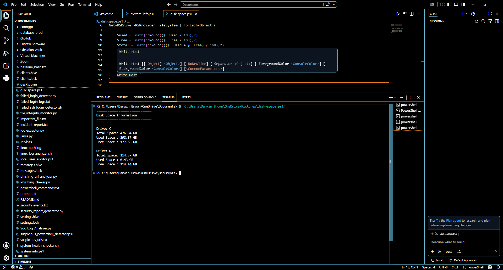
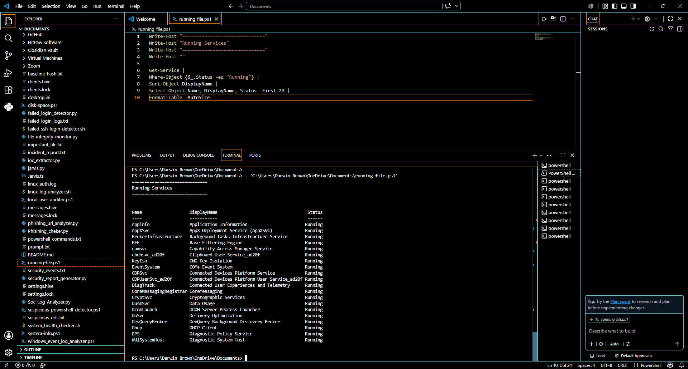
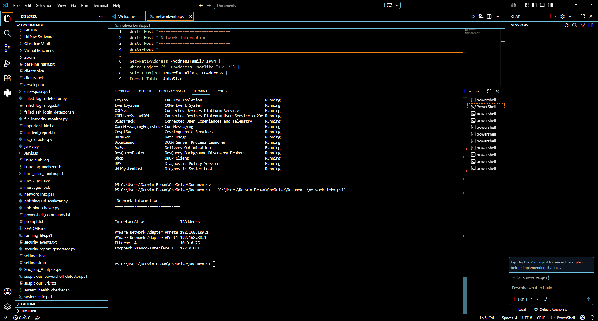
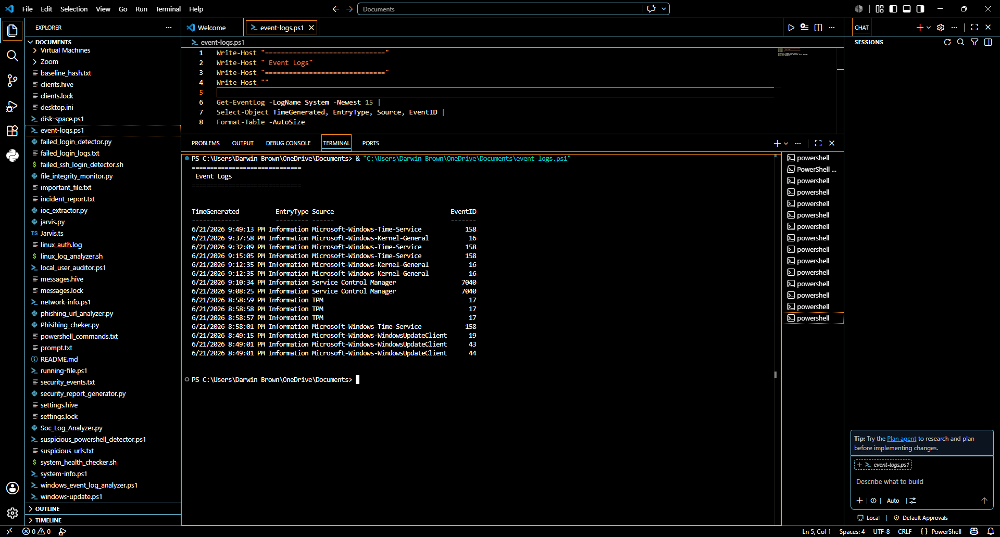

# Darwin PowerShell Help Desk Toolkit

## Overview

The Darwin PowerShell Help Desk Toolkit is a collection of PowerShell scripts designed to automate common Level 1 Help Desk tasks. These scripts gather system information, check disk usage, monitor services, retrieve network details, and assist technicians with troubleshooting Windows computers.

This project demonstrates practical PowerShell scripting skills commonly used in IT Support, Help Desk, and Desktop Support environments.

---

## Objectives

- Automate repetitive Help Desk tasks
- Improve troubleshooting efficiency
- Collect important system information
- Generate useful reports for technicians
- Practice PowerShell administration

---

## Skills Demonstrated

- PowerShell Scripting
- Windows Administration
- System Diagnostics
- Disk Management
- Network Troubleshooting
- Windows Services
- Automation
- IT Support
- Help Desk Operations

---

## Scripts Included

### System Information
Displays:

- Computer Name
- Current User
- Operating System
- Windows Version
- Processor
- Installed RAM
- Last Boot Time
- IP Address

---

### Disk Space Checker

Displays:

- Drive Letter
- Total Space
- Free Space
- Used Space
- Percentage Free

---

### Running Services

Lists:

- Running Windows Services
- Stopped Services
- Service Status

---

### Network Information

Displays:

- IPv4 Address
- MAC Address
- Default Gateway
- DNS Servers

---

### Windows Update Status

Checks:

- Windows Version
- Update Status
- Last Installed Updates

---

### Event Log Viewer

Retrieves:

- Recent System Errors
- Warning Events
- Critical Events

---

## Folder Structure

```
Darwin-PowerShell-Help-Desk-Toolkit
│
├── README.md
├── system-info.ps1
├── disk-space.ps1
├── running-services.ps1
├── network-info.ps1
├── windows-update.ps1
├── event-logs.ps1
│
└── screenshots
    ├── 01-system-information.png
    ├── 02-disk-space.png
    ├── 03-running-services.png
    ├── 04-network-information.png
    ├── 05-windows-updates.png
    └── 06-event-logs.png

---

## Screenshots

### System Information

Displays computer details including operating system, CPU, RAM, boot time, and IP address.


### Disk Space



### Running Services



### Network Information



### Windows Updates


### Event Logs



---

## Requirements

- Windows 10 or Windows 11
- Windows PowerShell 5.1 or newer
- Visual Studio Code (optional)
- PowerShell Extension for VS Code

---

## How to Run

Open PowerShell inside the project folder and execute:

```powershell
.\scripts\system-info.ps1
```

Run other scripts the same way:

```powershell
.\scripts\disk-space.ps1

.\scripts\running-services.ps1

.\scripts\network-info.ps1

.\scripts\windows-update.ps1

.\scripts\event-logs.ps1
```

---

## Technologies Used

- PowerShell
- Windows 11
- Visual Studio Code
- Windows Management Instrumentation (WMI)
- CIM Cmdlets

---

## Resume Skills

- Help Desk Support
- Technical Support
- PowerShell Automation
- Windows Administration
- Desktop Support
- IT Troubleshooting
- System Diagnostics

---

## Author

**Darwin Brown**
