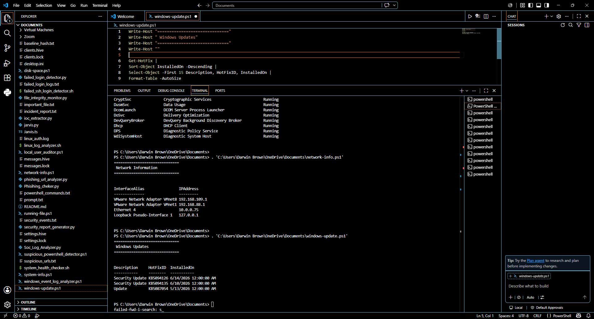

# Darwin PowerShell Help Desk Toolkit

## Overview

The Darwin PowerShell Help Desk Toolkit is a collection of PowerShell scripts designed to automate common Level 1 Help Desk tasks. These scripts gather system information, check disk usage, monitor Windows services, retrieve network details, display installed updates, and review recent Event Logs.

This project demonstrates practical PowerShell scripting skills commonly used in IT Support, Help Desk, Desktop Support, and System Administration roles.

---

## Features

- View system information
- Check disk space usage
- List running Windows services
- Display active network information
- View recently installed Windows updates
- Review recent Windows System Event Logs

---

## Scripts

### system-info.ps1

Displays:

- Computer Name
- Current User
- Operating System
- Windows Version
- CPU
- Installed RAM
- System Boot Time
- IPv4 Addresses

---

### disk-space.ps1

Displays:

- Drive Letter
- Total Disk Space
- Used Space
- Free Space

---

### running-services.ps1

Displays the first 20 running Windows services, including:

- Service Name
- Display Name
- Status

---

### network-info.ps1

Displays:

- Active Network Adapter
- IPv4 Address

---

### windows-update.ps1

Displays recently installed:

- Windows Updates
- Security Updates
- HotFix IDs
- Installation Dates

---

### event-logs.ps1

Displays the latest Windows System Event Logs including:

- Time Generated
- Entry Type
- Source
- Event ID

---

## Requirements

- Windows 10 or Windows 11
- PowerShell 5.1 or later

---

## How to Run

Open PowerShell in the project folder and run any script.

Example:

```powershell
.\system-info.ps1
```

Or:

```powershell
.\disk-space.ps1
```

---

## Screenshots

### System Information
Displays computer details including operating system, CPU, RAM, boot time, and IP address.


### Disk Space
Shows total, used, and free disk space for all drives.


### Running Services
Lists currently running Windows services to assist with troubleshooting.


### Network Information
Displays active network adapters and assigned IPv4 addresses.


### Windows Updates
Displays recently installed Windows updates and security patches.



### Event Logs
Displays the most recent Windows System Event Logs for troubleshooting and monitoring.


Displays the most recent Windows System Event Logs for troubleshooting and monitoring.


---

## Skills Demonstrated

- PowerShell Scripting
- Windows Administration
- Windows Services
- System Information Gathering
- Disk Management
- Network Configuration
- Windows Update Management
- Windows Event Log Analysis
- Help Desk Troubleshooting
- IT Automation

---

## Author

**Darwin Brown**
